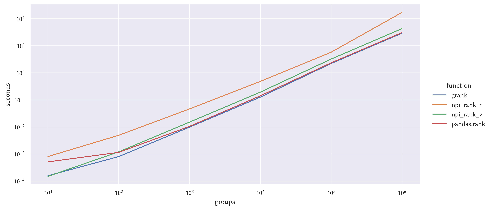

# Numpy in-group ranking

This package provides numpy-based vectorized in-group
[ranking](https://en.wikipedia.org/wiki/Ranking) as an alternative to
[pandas.GroupBy.rank](https://pandas.pydata.org/docs/reference/api/pandas.core.groupby.DataFrameGroupBy.rank.html). It's
mainly for fun and is not optimized, but I do use it to avoid importing pandas
when I only need pandas for ranking.

The package is greatly inspired by
[numpy-indexed](https://github.com/EelcoHoogendoorn/Numpy_arraysetops_EP) and
[scipy](https://docs.scipy.org/doc/scipy/reference/generated/scipy.stats.rankdata.html).

The test cases are mostly adopted from
[scipy](https://github.com/scipy/scipy/blob/main/scipy/stats/tests/test_rank.py).

## Usage

```
from grank import grank
gid = [0, 1, 0, 0, 1, 0, 1, 2, 2, 1]
val = [1, 6, 6, 4, 6, 4, 7, 7, 7, 6]
ranks = grank(val, gid, method="average")
assert_array_equal(ranks, [1, 2, 4, 2.5, 2, 2.5, 4, 1.5, 1.5, 2])
```

## Benchmark

- CPU: 12th Gen Intel(R) Core(TM) i9-12900H
- Group size: 100

### Average


|   groups |   grank |   npi_rank_n |   npi_rank_v |   pandas.rank |
|---------:|--------:|-------------:|-------------:|--------------:|
|       10 |   0.000 |        0.011 |        0.000 |         0.001 |
|      100 |   0.001 |        0.005 |        0.001 |         0.001 |
|     1000 |   0.013 |        0.049 |        0.018 |         0.010 |
|    10000 |   0.148 |        0.500 |        0.216 |         0.138 |
|   100000 |   2.489 |        6.046 |        3.544 |         2.293 |
|  1000000 |  31.939 |      170.478 |       46.090 |        30.219 |

### Min


|   groups |   grank |   npi_rank_n |   npi_rank_v |   pandas.rank |
|---------:|--------:|-------------:|-------------:|--------------:|
|       10 |   0.000 |        0.001 |        0.000 |         0.000 |
|      100 |   0.001 |        0.005 |        0.001 |         0.001 |
|     1000 |   0.010 |        0.046 |        0.016 |         0.010 |
|    10000 |   0.141 |        0.486 |        0.213 |         0.144 |
|   100000 |   2.342 |        5.850 |        3.539 |         2.308 |
|  1000000 |  30.712 |      169.692 |       46.045 |        30.498 |

### Max


|   groups |   grank |   npi_rank_n |   npi_rank_v |   pandas.rank |
|---------:|--------:|-------------:|-------------:|--------------:|
|       10 |   0.000 |        0.001 |        0.000 |         0.000 |
|      100 |   0.001 |        0.004 |        0.001 |         0.001 |
|     1000 |   0.010 |        0.045 |        0.016 |         0.010 |
|    10000 |   0.132 |        0.463 |        0.212 |         0.138 |
|   100000 |   2.292 |        5.643 |        3.481 |         2.292 |
|  1000000 |  30.259 |      165.771 |       46.828 |        30.206 |

### Dense


|   groups |   grank |   npi_rank_n |   npi_rank_v |   pandas.rank |
|---------:|--------:|-------------:|-------------:|--------------:|
|       10 |   0.000 |        0.001 |        0.000 |         0.000 |
|      100 |   0.001 |        0.004 |        0.001 |         0.001 |
|     1000 |   0.010 |        0.043 |        0.010 |         0.010 |
|    10000 |   0.125 |        0.460 |        0.130 |         0.136 |
|   100000 |   2.257 |        5.443 |        2.269 |         2.277 |
|  1000000 |  29.825 |      165.607 |       30.051 |        30.539 |

### Ordinal



|   groups |   grank |   npi_rank_n |   npi_rank_v |   pandas.rank |
|---------:|--------:|-------------:|-------------:|--------------:|
|       10 |   0.000 |        0.001 |        0.000 |         0.001 |
|      100 |   0.001 |        0.005 |        0.001 |         0.001 |
|     1000 |   0.010 |        0.046 |        0.015 |         0.011 |
|    10000 |   0.127 |        0.483 |        0.193 |         0.141 |
|   100000 |   2.205 |        5.760 |        3.221 |         2.335 |
|  1000000 |  28.985 |      169.427 |       42.822 |        30.575 |
