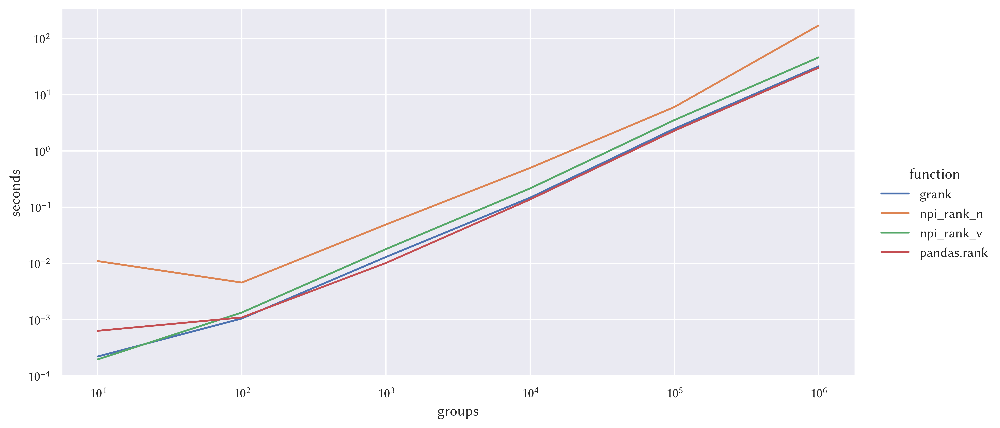
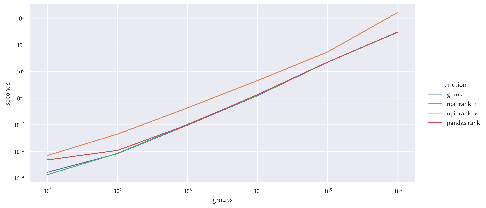

# Numpy in-group ranking

This package provides numpy-based vectorized in-group
[ranking](https://en.wikipedia.org/wiki/Ranking) as an alternative to
[pandas.GroupBy.rank](https://pandas.pydata.org/docs/reference/api/pandas.core.groupby.DataFrameGroupBy.rank.html). It's
mainly for fun and is not optimized, but I do use it to avoid importing pandas
when I only need pandas for ranking.

The package is greatly inspired by
[numpy-indexed](https://github.com/EelcoHoogendoorn/Numpy_arraysetops_EP) and
[scipy](https://docs.scipy.org/doc/scipy/reference/generated/scipy.stats.rankdata.html).

The test cases are mostly adopted from
[scipy](https://github.com/scipy/scipy/blob/main/scipy/stats/tests/test_rank.py).

## Usage

```
from grank import grank
gid = [0, 1, 0, 0, 1, 0, 1, 2, 2, 1]
val = [1, 6, 6, 4, 6, 4, 7, 7, 7, 6]
ranks = grank(val, gid, method="average")
assert_array_equal(ranks, [1, 2, 4, 2.5, 2, 2.5, 4, 1.5, 1.5, 2])
```

## Benchmark

- CPU: 12th Gen Intel(R) Core(TM) i9-12900H
- Group size: 100

### Average



|   groups |   grank |   npi_rank_n |   npi_rank_v |   pandas.rank |
|---------:|--------:|-------------:|-------------:|--------------:|
|       10 |   0.000 |        0.001 |        0.000 |         0.001 |
|      100 |   0.001 |        0.005 |        0.001 |         0.001 |
|     1000 |   0.012 |        0.048 |        0.016 |         0.010 |
|    10000 |   0.150 |        0.506 |        0.220 |         0.145 |
|   100000 |   2.509 |        6.140 |        3.606 |         2.320 |
|  1000000 |  32.441 |      176.049 |       47.000 |        30.271 |

### Min


|   groups |   grank |   npi_rank_n |   npi_rank_v |   pandas.rank |
|---------:|--------:|-------------:|-------------:|--------------:|
|       10 |   0.000 |        0.001 |        0.000 |         0.000 |
|      100 |   0.001 |        0.005 |        0.001 |         0.001 |
|     1000 |   0.010 |        0.046 |        0.016 |         0.010 |
|    10000 |   0.137 |        0.480 |        0.211 |         0.146 |
|   100000 |   2.313 |        5.707 |        3.464 |         2.274 |
|  1000000 |  30.427 |      167.877 |       45.522 |        30.126 |

### Max


|   groups |   grank |   npi_rank_n |   npi_rank_v |   pandas.rank |
|---------:|--------:|-------------:|-------------:|--------------:|
|       10 |   0.000 |        0.001 |        0.000 |         0.000 |
|      100 |   0.001 |        0.004 |        0.001 |         0.001 |
|     1000 |   0.010 |        0.044 |        0.016 |         0.010 |
|    10000 |   0.131 |        0.463 |        0.211 |         0.143 |
|   100000 |   2.293 |        5.632 |        3.477 |         2.262 |
|  1000000 |  29.894 |      165.716 |       45.775 |        29.880 |

### Dense



|   groups |   grank |   npi_rank_n |   npi_rank_v |   pandas.rank |
|---------:|--------:|-------------:|-------------:|--------------:|
|       10 |   0.000 |        0.001 |        0.000 |         0.001 |
|      100 |   0.001 |        0.005 |        0.001 |         0.001 |
|     1000 |   0.010 |        0.045 |        0.011 |         0.011 |
|    10000 |   0.131 |        0.473 |        0.133 |         0.141 |
|   100000 |   2.287 |        5.687 |        2.270 |         2.300 |
|  1000000 |  30.178 |      167.345 |       29.952 |        29.684 |

### Ordinal


|   groups |   grank |   npi_rank_n |   npi_rank_v |   pandas.rank |
|---------:|--------:|-------------:|-------------:|--------------:|
|       10 |   0.000 |        0.001 |        0.000 |         0.000 |
|      100 |   0.001 |        0.004 |        0.001 |         0.001 |
|     1000 |   0.009 |        0.044 |        0.015 |         0.010 |
|    10000 |   0.129 |        0.469 |        0.191 |         0.138 |
|   100000 |   2.149 |        5.551 |        3.103 |         2.263 |
|  1000000 |  28.701 |      166.301 |       41.636 |        29.796 |
